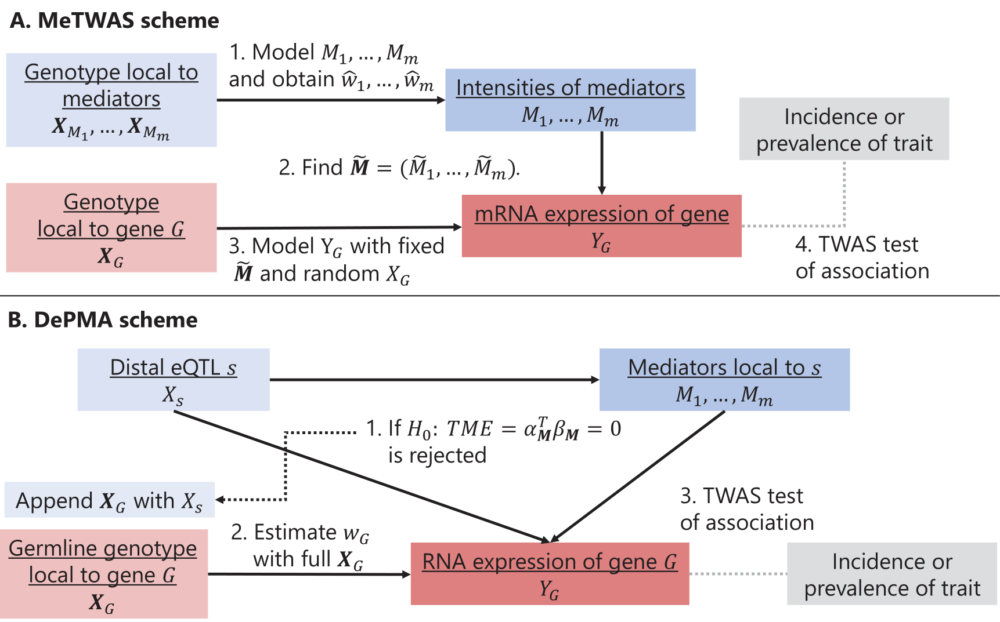

# Multi-Omic Strategies for TWAS (MOSTWAS)

# Introduction to transcriptome-wide association studies (TWAS)

TWAS are techniques that were concurrently
created by [Gamazon et al, 2015](https://www.ncbi.nlm.nih.gov/pubmed/26258848)
and [Gusev et al, 2016](https://www.ncbi.nlm.nih.gov/pubmed/26854917)
to leverage eQTLs to identify gene-trait associations.
A traditional TWAS pipeline is as follows:

1. In a tissue that is relevant to a phenotype of interest (i.e. breast tumor
for breast cancer outcomes or the pre-frontal cortex for neuropsychiatric disorders),
we train predictive models of tissue-specific expression from genotype.
2. Then, in a large GWAS cohort, we use these predictive models
to impute tissue-specific genetically regulated expression to detect
gene-trait associations.

In training predictive expression models, most TWAS methods (e.g. [PrediXcan](https://www.ncbi.nlm.nih.gov/pubmed/26258848), 
[FUSION](https://www.ncbi.nlm.nih.gov/pubmed/26854917), 
[TIGAR](https://www.ncbi.nlm.nih.gov/pubmed/31230719), 
[EpiXcan](https://www.nature.com/articles/s41467-019-11874-7), etc)
focus on local genetic variation around the gene of interest (0.5 to 1 Megabase
around the gene). However, [Boyle et al, 2017](https://www.ncbi.nlm.nih.gov/pubmed/28622505) and 
[Liu et al, 2019](https://www.ncbi.nlm.nih.gov/pubmed/31051098) have proposed 
that up to 70% of gene expression can be attributed
to distal variation in the genome, suggesting
that the inclusion of these distal variants
in TWAS models may improve prediction and power to detect
gene-trait associations.

For this reason, we have developed **M**ulti-**O**mic
**S**trategies for **TWAS** (**MOSTWAS**),
an intuitive suite of tools to prioritize distal
variants in transcriptomic prediction and conduct
TWAS-like association testing using GWAS summary statistics.
MOSTWAS incorporates two
methods to include distal-eQTLs
in transcriptomic prediction: Mediator-enriched
TWAS (MeTWAS) and distal-eQTL prioritization
via mediation analysis (DePMA). These
methods are summarized graphically
below.



* MeTWAS first
identifies *m* mediators
(e.g. CpG sites,
miRNAs, gene coding
for transcription
factors, etc) such
that the intensity (methylation
or expression levels) 
of these mediators are associated
to the mRNA expression. A model
for the
genetically regulated intensities
(GRIn)
is estimated using
the local SNPs
to these mediators, and
the GRIn of these mediators
are imputed into the training
set. The final gene expression model
is estimated by incorporating
the GRIn of the mediators
as fixed effects and 
the local SNPs 
to the gene as regularized
effects (see Methods
for more details).

* DePMA
first identified
testing triplets
of the gene of
interest, a distal
eSNP (SNP
in an eQTL) to the gene,
and any associated mediators local
to the eQTL. We estimate
the total mediation effect (TME) 
of the eQTL on the gene
through the set of mediators
and test the two-sided
hypothesis that *TME = 0*.
Any distal-eSNP with a significant
TME is included with the SNPs
local to the gene of interest
to form the final design matrix.
A model including all
local SNPs and all significant
distal-eSNPs is fit to
the expression of the gene
using either elastic net
or linear mixed modeling (see Methods
for more details).

All MOSTWAS models output:

* the SNP-gene effect sizes (i.e. the model),
* cross-validation *R*<sup>2<sup>,
* heritability estimate from GCTA,
* *P*-value for the likelihood ratio test for heritability, and
* predicted expression in the reference panel.

We recommend training genes with both MeTWAS
and DePMA and prioritizing the model with
greater cross-validation *R*<sup>2<sup> 
for association testing.


# Using MOSTWAS

MOSTWAS is meant to be run on a high-performance cluster (HPC)
and integrates with [PLINK](http://zzz.bwh.harvard.edu/plink/) 
and [GCTA](https://cnsgenomics.com/software/gcta/) to
perform file formatting, linkage disequilibrium estimation,
and heritability estimation. If your HPC already has
PLINK and GCTA installed, be sure to load and add those
modules to your personal PATH with something like this:

```
module add plink
module add gcta
```

If PLINK and GCTA aren't automatically installed,
you can simply download and install these software
add them manually to your PATH:

```
module use /path/to/personal/plink
module use /path/to/persona/gcta
module load plink
module load gcta64
module add plink
module add gcta
```

Now, we can go to `R` to use MOSTWAS.

## Installing MOSTWAS

MOSTWAS is available freely on Github.
To install the package:

```
devtools::install_github('bhattacharya-a-bt/MOSTWAS')
```

## Necessary input files

Let's assume that the reference eQTL panel has *n* samples.
MOSTWAS, at the very least, requires the input
files for the following:

1. SNP dosages and locations,
2. gene expression and locations,
3. mediator intensities and locations, and
4. relevant covariates.

Mediators can include any biomarker that may
influence the transcription of a gene (i.e.
transcription factors, microRNAs, DNA CpG methylation sites,
etc). The term "intensity" here is used as a catch-all term
for expression and methylation of mediators.

MOSTWAS uses files that are formatted
in the `MatrixEQTL` format (see the
[MatrixEQTL](http://www.bios.unc.edu/research/genomic_software/Matrix_eQTL/) 
documentation). Briefly, SNP dosage, gene expression,
and mediator intensity files all have *n+1* columns, where
the first column is an identifier for the biomarker (SNP, gene, or mediator)
and the last *n* columns are the scaled values for that biomarker.
The location files have columns (in order) for the identifier,
the chromosome, and the base-pair position of the biomarker.
Gene location files have a fourth column with the end location of the gene.

We recommend that the file that contains the covariates include principal
components of the SNP dosage matrix (in the range of 5-20, depending
on the dataset). Relevant clinical covariates can be included as well.
This file has *n+1* columns, where the first column is the identifier
for the covariate and the last *n* columns contain
the values for the covariates across the *n* samples.

The `convertToDosage()` function
can convert a .vcf or binary PLINK format (BED/BIM/FAM) into 
the dosage files needed for MOSTWAS.

## eQTL analysis

MeTWAS and DePMA require results for QTL analysis:

* MeTWAS requires associations between mediators and genes, and
* DePMA requires distal-eQTLs between SNPs and genes, and local mediator QTLs
for those distal-eQTLs.

We have provided a wrapper function to do these eQTL analyses with `MatrixEQTL`:

```{r, eval=F}
eQTL_MOSTWAS(SNP_file_name = 'snps.txt',
             snps_location_file_name = 'snpLocs.txt',
             SNP_file_name_dis = 'snps_dis.txt',
             expression_file_name = 'genes.txt',
             gene_location_file_name = 'geneLocs.txt',
             mediators_file_name = 'mediators.txt',
             meds_location_file_name = 'medLocs.txt',
             covariates_file_name = 'covs.txt',
             output_file_name_loc_qtl = 'out_loc_qtl.txt',
             output_file_name_dis_qtl = 'out_dis_qtl.txt',
             output_file_name_loc_med = 'out_loc_med.txt',
             output_file_name_dis_med = 'out_dos_med.txt',
             p_loc_qtl = 1e-6,
             p_dis_qtl = 1e-6,
             FDRcut = 0.05,
             useModel = 'modelLinear',
             DePMA = F)
```

We have provided a toggle `DePMA` that takes in a logical object (i.e. `TRUE` or `FALSE`)
to do either QTL analysis for DePMA or MeTWAS.
`MatrixEQTL` is also a very intuitive software, so you
can easily code your own analyses. 

**Please cite [Shabalin 2012](https://www.ncbi.nlm.nih.gov/pubmed/22492648) if you use MOSTWAS!**

## Training models with MeTWAS

MOSTWAS wrapper functions have multiple options to provide
users with freedom in training predictive models. It may get a little
confusing, but we'll cover the options one-by-one.

You can run MeTWAS all in one, for a given gene (call this gene `test`):

```{r, eval=F}
trainExpression(geneInt = 'test', ## name of gene of interest
                snps, ## data.frame or data.table for SNP dosages
                snpLocs, ## SNP locations
                mediator, ## mediator intensities
                medLocs, ## mediator locations (four column as in gene locations)
                covariates,
                dimNumeric = 10, ## number of dimensions of covariates that are genotype PCs (usually 5-10)
                qtlFull = data.table::fread('out_dis_qtl.txt'), ## mediator QTLs (mediators to genes)
                h2Pcutoff = 0.05, ## P-value cutoff for likelihood ratio test for heritability estimation
                numMed = 5, ## number of mediators considered per gene
                seed, ## seed for reproducibility
                k, ## number of folds for cross-validation
                cisDist = 5e5, ## window for local SNPs
                parallel = F, ## parallelize fitting local-only mediator models
                prune = T, ## toggle LD pruning
                windowSize = 50, ## window size for PLINK LD pruning
                numSNPShift = 5, ## shifting window for PLINK LD pruning
                ldThresh = .5, ## LD threshold for LD pruning
                cores = 5, ## number of cores for parallelization
                verbose = T,
                LDMS = T, ## toggle for GCTA-LDMS
                modelDir = '/path/to/MeTWASmodels', ## folder for MeTWAS locations 
                ldScrRegion = 200, ## region size parameter for GCTA-LDMS
                snpAnnot = NULL ## annotation file for reference and alternative alleles
                ) 
```

A few notes on these options:

* `dimNumeric` takes in the number of leading rows of the `covariates` file that
are genotype PCs for heritability estimation using GCTA.
* `qtlFull` takes in the QTL results, as a `data.frame` or `data.table` 
that give associations between mediators and genes.
* `h2Pcutoff` gives a *P*-value cutoff for heritability estimation using GCTA
* `numMed` gives an upper limit to the number of top gene-associated mediators to limit
computational time
* `parallel` toggles parallel fitting of the `numMed` local-only models of mediators with
an `mclapply()` implementation. The `cores` option allows you to set the number
of parallel cores for this implementation and doesn't need to be larger than `parallel`.
* `prune` togggles wheter the SNP dosages need to be LD-pruned. We have seen
previously that LD-pruning may improve prediction 
[Bhattacharya et al 2020](https://genomebiology.biomedcentral.com/articles/10.1186/s13059-020-1942-6).
`windowSize`, `numSNPShift`, and `ldThresh` provide the three parameters that PLINK
uses.
* We have also included the option to use GCTA-LDMS for heritability estimation, which is toggled
with `LDMS = T`. We recommend this generally for imputed SNP panels.
* `snpAnnot` takes in a data.frame of SNP annotations that includes three columns. This
is generally needed if the SNP identifiers are not in 1000GP form (i.e. chrom:position:REF:ALT).


## Training models with DePMA

You can run DePMA all in one, for a given gene (call this gene `test`). Many
of the options are similar, so we'll highlight the different
options in DePMA:

```{r, eval=F}
trainDeP(geneInt = 'test',
         snps,
         snpLocs,
         mediator,
         medLocs,
         covariates,
         cisDist = 5e5,
         qtlTra, # full distal eQTL data.frame
         qtMed, # full local mediator QTL data.frame
         h2Pcutoff,
         dimNumeric,
         verbose,
         seed,
         sobel = F, # toggle to T if using the asymptotic Sobel test for mediation analysis
         nperms = 1000, # number of permutations for permutation test for mediation analysis
         k,
         parallel = F,
         parType = 'no', # parallelization type for permutation testing (uses boot package)
         prune,
         windowSize = 50,
         numSNPShift = 5,
         ldThresh = .5,
         cores,
         qtlTra_parts, # vector of filenames for distal eQTLs for training sets (needed for cross-validation)
         qtMed_parts, # vector of filenames for local mediator QTLs for training sets (needed for CV)
         modelDir,
         snpAnnot = NULL)
```

A few notes on these options:

* `qtlTra` and `qtMed` take in outputs from `eQTL_MOSTWAS` if the `DePMA = T` toggle
is set. These are `data.frame` or `data.table` objects that contain
the MatrixEQTL output for associations between distal SNPs and genes and those distal-eQTLs
and any local mediators. For cross-validation (generally *k < 5* folds), you
must also run fold-wise QTL analysis and input these filenames in
`qtlTra_parts` and `qtMed_parts` as character vectors.
* `sobel` toggles whether the asymptotic Sobel test is used, instead of the permutation
test, to test if the total mediation effect for a distal-eQTL is large. The asymptotic
Sobel test is less powerful yet much faster compared to the permutation test.
* We use the `boot` package for permutation. `nperms` sets the number
of resamplings in permutation test, and `parType` sets the parallelization
method as in the `boot` package.

## Running multiple genes in parallel

Usually, you'll need to train models for 15,000+ genes in
an RNA-seq panel. Serially running both MeTWAS and DePMA is very slow, even
when parallelizing within a single gene. We recommend a batch submission procedure,
perhaps using the `rslurm` package. Given that the genes of interest
as in the vector `geneList`, we can simply define a `data.frame`
of parameters and submit multiple jobs all in one:

```{r, eval=F}
pars = data.frame(geneInt = geneList)
batch_DeP <- function(geneInt){
  trainDeP(geneInt,snps,snpLocs,mediator,...)
}
library(rslurm)
sjob <- slurm_apply(batch_DeP, pars, jobname = 'test_DePMA',
                    nodes = 2, cpus_per_node = 2, submit = TRUE)
```

This generates `R` scripts for every gene and submits them to
your SLURM cluster. You can delete all the files using
`cleanup_files(sjob)`.

Other options include the `BatchJobs` [package on CRAN](https://cran.r-project.org/web/packages/BatchJobs/BatchJobs.pdf)
or [snakemake](https://snakemake.readthedocs.io/en/stable/).

With `slurm_apply()`, we were able to fit a whole RNA-seq panel
using both MeTWAS and DePMA in roughly 28 hours.

## FUSION-like association testing
We provide functions for testing as well.
The function `burdenTest()` does the weighted burned test
of association
and gives the option for permutation testing, as
in [FUSION](https://www.ncbi.nlm.nih.gov/pubmed/26854917):

```{r, eval=F}
burdenTest(wgt, ### .RData file name for a given gene's MOSTWAS model
           snps, ### data.frame/data.table for SNP dosages
           sumStats, ### data.frame/data.table for GWAS summary statistics
           snpAnnot = NULL,
           onlyCis = F, ### toggle to include only local SNPs
           beta, ### column name for effect sizes in GWAS summary stats
           se, ### column name for standard errors for betas in GWAS summary stats
           chr, ### column name for SNP chromosome locations in GWAS summary stats
           pos, ### column name for SNP basepair position in GWAS summary stats
           ref, ### column name for SNP reference allele in GWAS summary stats
           pval, ### column name for P-value in GWAS summary stats
           R2cutoff = 0.01, ### cross-validation R2 cutoff to test a gene
           alpha, ### P-value cutoff in TWAS association to conduct permuation test
           nperms = 1e3 ### number of permutations in permuation test)
```

A comment on permutation testing:

* Permutation testing assess wheter the TWAS association persists when conditioning on
large GWAS effect sizes. This test is meant to be conservatively used, so we recommend
imposing a stringent *P*-value cutoff to prioritize a gene for permutation
testing (i.e. `alpha` at the Bonferroni cutoff).

## Distal-SNPs added last test

For genes with significant TWAS associations from `burdenTest()`,
we may be interested in assessing whether the distal SNPs provide
any added information beyond what we can observe from
the local variation around the gene of interest.
We developed an added-last test of distal SNPs using
summary statistics. It can be run using the `addedLastTest()` function
that take in similar options as `burdenTest()`:

```{r, eval=F}
addedLastTest(wgt,
              snps,
              sumStats,
              snpAnnot = NULL,
              beta,
              se,
              chr,
              pos,
              ref,
              pval,
              R2cutoff,
              locChrom ### chromosome on which the gene of interest exists)
```

The added-last test need not be run only on genes
prioritized for permutation testing. We recommned any significant
gene in overall TWAS association to be prioritized
for added-last testing. The results
from this test can allow users to focus on these distal
regions for functional hypothesis generation and possible
follow-up studies.
